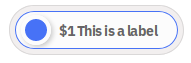

How to use in HTML:

``` html
<!-- place once in your HTML at the top -->
<script src="https://www.moneybutton.com/moneybutton.js"></script>
```

This script allows the user to create Money Button components in two different
ways:

* Using HTML tags with specific attributes that work as place holders for the button.
* Using the global `moneyButton` object to define Money Button components
dynamically with javascript.

## Defining buttons with HTML

When the document finishes loading, our script looks around the document for `<div>` elements with
the `money-button` class and certain attributes. Every `<div>` that matches the search is transformed into a Money Button component.

``` html
<!-- place your button(s) anywhere you want in your HTML -->
<div class="money-button"
  data-to=[to]
  data-amount=[amount]
  data-currency=[currency]
></div>
```

A Money Button `<div>` can take the following attributes:

| prop                     | type                                                           | default value |
| ------------------------ | -------------------------------------------------------------- | ------------- |
| `data-to`                | `string` (either a BSV address, a user number or a BSV script) | `null`        |
| `data-amount`            | `string`                                                       | `null`        |
| `data-currency`          | `string` (`'USD'`, `'BSV'`, etc.)                              | `'USD'`       |
| `data-label`             | `string`                                                       | `''`          |
| `data-success-message`   | `string`                                                       | `It's yours!` |
| `data-op-return`         | `string`                                                       | `null`        |
| `data-outputs`           | `string`                                                       | `'[]'`        |
| `data-client-identifier` | `string`                                                       | `null`        |
| `data-button-id`         | `string`                                                       | `null`        |
| `data-button-data`       | `string`                                                       | `null`        |
| `data-type`              | `string` (`'buy', 'tip'`)                                      | `'buy'`       |
| `data-on-payment`        | `string`                                                       | `null`        |
| `data-on-error`          | `string`                                                       | `null`        |
| `data-editable`          | `string` (`'true'` or `'false'`)                               | `'false'`     |
| `data-dev-mode`          | `string` (`'true'` or `'false'`)                               | `'false'`     |

### data-to

This attribute specifies who is going to receive the payment. It's a string, and depending on
its format it is interpreted in different ways:

* Natural number: If the value matches with a natural number ( `/^\d+$/` ) then it is interpreted
as a user number, so the receiver is a Money Button user with that exact user number.
* BSV Address: In this case the recipient of the transaction is going to be that address. The address does not need to belong to a Money Button user.
* Script: When the value can be interpreted as a valid BSV script using ASM format, then we use
that script as an output script.
* If the this attribute doesn't match with any of the previous forms, the button fails.

This argument works together with `data-amount` and `data-currency`. If one of them is present
the other two have to be present too.

If this attribute is present then `data-outputs` attributes cannot be present.

### data-amount and data-currency

`data-amount` is a decimal number expressed as a string.
`data-currency` is the ISO code of the currency for fiat, or the ticker symbol for cryptocurrencies. It's always
a three letter code.

These two combined specify the amount of money to be transferred when the button is swiped. The amount
is converted into BSV at the moment of the swipe.

Both of them work together with `data-to`. If any of the three is present, the other two have to be present too.

### data-label

Is the label of the button.



### data-success-message

After a successful payment the button shows a success animation with a success message.
This attribute allows you to specify a custom success message.

When this value is not present the button has different defaults regarding its type.
Tip buttons shows `You tipped!`, and buy buttons show `It's yours!`.

### data-op-return

If this attribute is present an extra output is added to the transaction with a simple `OP_RETURN` script
to post data on the BSV blockchain. The string is encoded in UTF-8 and used directly in the script.
The size limit is 220 bytes as determined by the BSV protocol.

### data-outputs

This attribute is used to specify a lists of outputs on the BSV transaction. It can't be used at the same
time with `data-to`, `data-amount` or `data-currency`.

`outputs` is a JSON string containing a lists of outputs. Each `element` may have the following properties:

| name       | type                          | required? |
| ---------- | ----------------------------- | --------- |
| `to`       | `string`                      | optional  |
| `type`     | `string`                      | optional  |
| `address`  | `string`                      | optional  |
| `userId`   | `string`                      | optional  |
| `script`   | `string`                      | optional  |
| `amount`   | `string`                      | required  |
| `currency` | `string` (`USD`, `BSV`, etc.) | required  |

`to`, `amount` and `currency` work exactly as the top level attributes with the same name, except for the
detail that all the outputs have to use the same currency. If there are 2 outputs using different
currencies the button will fail before rendering.

Instead of using `to` argument you can specify which kind of output you are using with the attribute `type`. `type`
can take any of these values:

| value        | description                                                              |
| ------------ | ------------------------------------------------------------------------ |
| `USER`       | Refers to a Money Button User. The attribute `userId` must be present.  |
| `ADDRESS`    | Refers to a BSV address. The attribute `address` must be present.       |
| `SCRIPT`     | Refers to an output script. The attribute `script` must be present.     |

### data-client-identifier

Each app that uses Money Button is called a "client" in the jargon of OAuth. Money Button supports multiple clients per account. This is useful when a user wants to use Money Button to build
several apps. When a transaction is done on a specific client the owner of the client can see the transaction even if they are not a recipient or sender of the funds.

More documentation about clients and OAuth will be available soon.

### data-button-id

This attribute is an identifier of the payment of the button. It can be used as an invoice number or reference number. It can be any string and it's attached to the payments
created with a specific button. Payments are stored with that string and then can be queried later using this attribute.

More documentation about Payments API will be available soon.

# data-button-data

This attribute can be any string, but is meant to be a valid JSON string. The user can set arbitrary
data here, that is associated with the payment and sent on the webhooks and retrieved with the API.

# data-on-payment

It's the name of a function defined in the global scope. The function is called when the user makes a successful payment.

``` html
<script>
  function myCustomCallback (payment) {
    console.log('Yay! A Payment!')
  }
</script>

<div class="money-button"
  data-to="[to]"
  data-amount="[amount]"
  data-currency="[currency]"
  data-on-payment="myCustomCallback"
></div>
```

They payment attribute is a javascript object with the following attributes:

| name         | type     | description                                                           |
| ------------ | -------- | --------------------------------------------------------------------- |
| `id`         | `string` | Unique Money Button id of the payment.                                |
| `buttonId`   | `string` | The identifier specified in the button used to pay.                   |
| `buttonData` | `string` | The data indicated in the button.                                     |
| `status`     | `string` | Status of the payment. More information on `webhooks` documentation.  |
| `txid`       | `string` | id of the BSV transaction.                                            |
| `ntxid`      | `string` | Normalized id of the BSV transaction.                                 |
| `amount`     | `string` | Total amount paid.                                                    |
| `currency`   | `string` | Currency of the button.                                               |
| `satoshis`   | `string` | Total amount expressed in Satoshis.                                   |
| `outputs`    | `array`  | Output details                                                        |

The function is always called in the context of 'window' object.

### data-on-error

It's the name of a function defined in the global scope. The function is called when an error occurs during the payment.
Is not called if there is a problem with the parameters of the button or if there is a problem related with compatibility.

``` html
<script>
  function myCustomCallback (error) {
    console.log(`Oh no! Something went wrong: ${error}`)
  }
</script>

<div class="money-button"
  data-to="[to]"
  data-amount="[amount]"
  data-currency="[currency]"
  data-on-error="myCustomCallback"
></div>
```

The parameter received by the function is the description of the error.
The function is always called in the context of `window` object.

### data-dev-mode

This attribute is `false` by default. If it is set to `true` the button becomes a dummy component. It doesn't
execute any callback and doesn't interact with the backend at all. Instead it always succeeds.

### data-editable

When this attribute is true the button is displayed in an editable mode, allowing the user
to set the amount of the transaction before pay. When this attribute is set to `true` the
values of `data-to`, `data-amount`, `data-currency` and `data-outputs` are ignored.
Editable buttons are able to have `OP_RETURN` using the attribute `data-op-return`.

## The `moneyButton` object

Our script also defines a global object called `moneyButton`. Right now
it provides only one function `render`.

### render

``` html
<div id='some-div'></div>
<script>
  const div = document.getElementById('some-div')
  moneyButton.render(div, {
    amount: "1",
    to: "12cRRk9wn2LofWKE2wwxb7mw5qNeMaW7zH",
    currency: "USD",
    label: "Wait...",
    clientIdentifier: "some public client identifier",
    buttonId: "234325",
    buttonData: "{}",
    type: "tip",
    onPayment: function (arg) { console.log('onPayment', arg) },
    onError: function (arg) { console.log('onError', arg) }
  })
</script>
```

`moneyButton.render` takes two parameters. The first one is an DOM node. The button
is going to be placed inside that DOM node. The second one is an object with options.

The available options are:


| prop                | type                                      | default value  |
| ------------------- | ----------------------------------------- | -------------- |
| `to`                | `string` (either a BSV address or userId) | `null`         |
| `amount`            | `string`                                  | `null`         |
| `currency`          | `string` (`'USD'`, `'BSV'`, etc.)         | `'USD'`        |
| `label`             | `string`                                  | `''`           |
| `opReturn`          | `string`                                  | `null`         |
| `outputs`           | `array`                                   | `[]`           |
| `clientIdentifier ` | `string`                                  | `null`         |
| `buttonId`          | `string`                                  | `null`         |
| `buttonData`        | `string`                                  | `null`         |
| `type`              | `string` (`'buy', 'tip'`)                 | `'buy'`        |
| `onPayment`         | `function`                                | `null`         |
| `onError`           | `function`                                | `null`         |
| `devMode`           | `string` (`'true'` or `'false'`)          | `'false'`      |


All the options are matched with the attributes of the HTML API, and have the exact
same behavior.

The callbacks are only called on events related to payments, and they are always
executed in the context of the `window` object.
